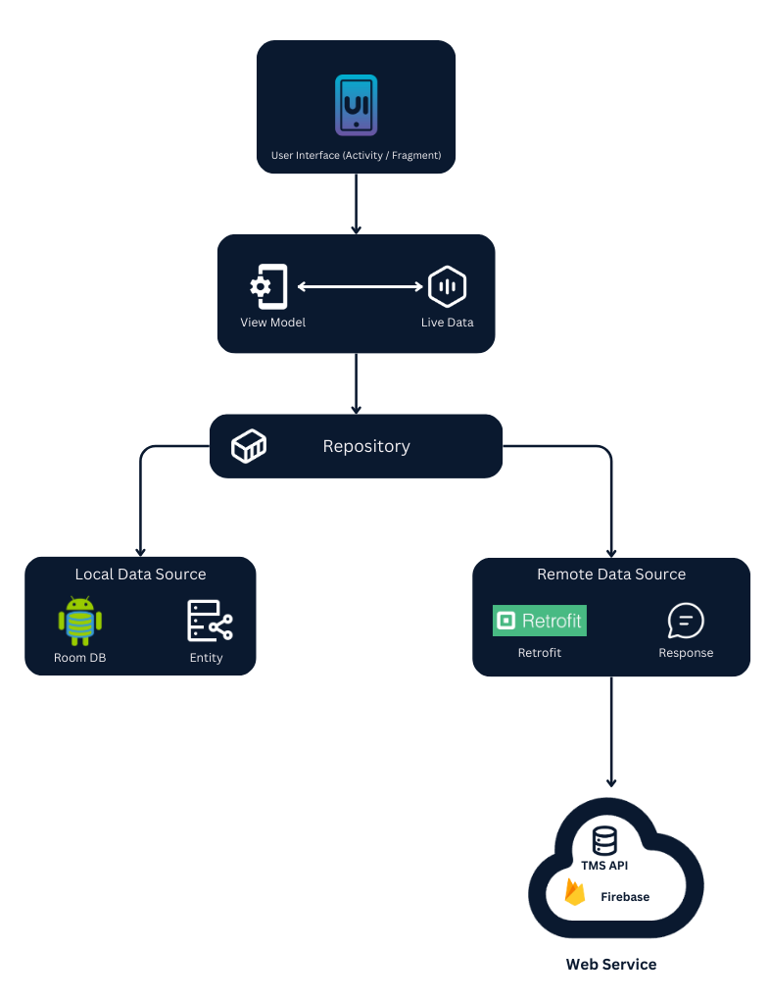
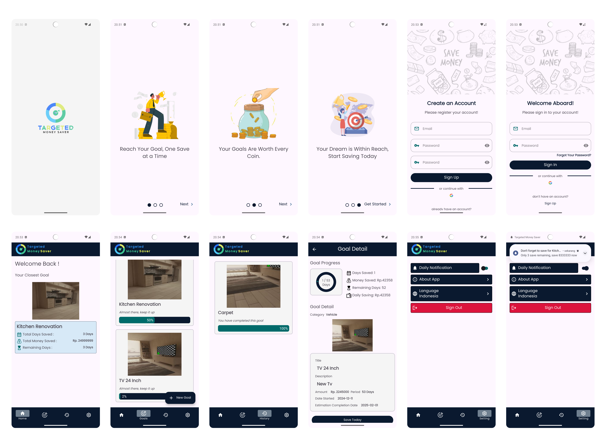

# Targeted Money Saver Android Application

## Architecture


## Application Screenshoot


## User Interface Design
- [Figma](https://www.figma.com/design/mt57dSF9OE76t4v6ma1W2G/TMS-%3A-Targeted-Money-Saver?node-id=47-74&node-type=frame&t=XlmS2Pblj615rjAF-0)

## Features
- Splash Screen\
  Displays the TMS logo when the app is launched.
- Sign Up\
  Allows users to create a new account with an email, and password.
- Sign In\
  Registered users can log in using their email and password.
- Home\
  The main screen of the app with quick information for the closest goal. 
- Goals\
  Displays a list of personal goals set by the user, helping them track their progress and stay motivated.	
- Goal Details\
  Provides detailed information about a specific goal, including its progress, remaining days, and total amount saved for the goal.
- Add Goal\
  Lets users create new goals by entering a title, description, goal amount, and goal period.
- History\
  Keeps a record of all user completed goals.
- Settings\
  Allows users to customize app preferences, such as notifications. 
- About App\
  Gives information about TMS Application and its brief description.
- Log out\
  Allows users to securely log out of their account.

## Permission
- Internet\
  The application requires internet access to connect to the server and fetch data for features like user login and get all of user goals.
- Camera\
  The application needs camera access to capture images of the user goal.
- Post Notification\
  The application requires permission to send notifications to the user for updates and alerts.

## Requirement

- Android Studio
- Target device (Android device or emulator) with minimum android version of 10(Q) or higher

## Installation

- Download or Clone this project to your computer
    
    - Repository Link : https://github.com/TMS-Targeted-Money-Saver/TMS-Android

    - On the github repository page, click on the “Code” button and select “Download ZIP” and extract the downloaded zip file to your computer
    
        -OR-

    - Clone the repository :
    
        ```
        git clone https://github.com/TMS-Targeted-Money-Saver/TMS-Android.git
        ```

- Open the project in android studio
- Run the application
  Ensure that your Android device is connected to your computer or that you have set up an emulator to run the app. Click the “Run” button (green triangle) in the Android Studio toolbar to launch the application. The app will be installed on the selected device or emulator.